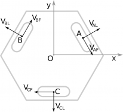

# Calculs liés aux mouvements du robot

## Généralités et notations

On note $(x, y, \theta_z)$ la position du robot, avec les roues positionnées de la manière suivante : 

La vitesse du robot selon les 3 axes sera notée $(V_x, V_y, \omega_z)$.

Le référentiel utilisé sera toujours celui du robot (le déplacement sera toujours calculé en partant du principe que la position de départ est $(0, 0, 0)$)

## Objectif

L'objectif est de transformer ud déplacement quelconque vers les coordonnées $(x_f, y_f, \theta_f)$ en un mouvement pour chaque moteur, caractérisé par : 
- la vitesse de chaque moteur $V_{AF}$, $V_{BF}$, $V_{CF}$ (avec $V = R \omega$, $R$ rayon de la roue et $\omega$ vitesse de rotation)
- le nombre de pas que chaque moteur doit effectuer $N_A$, $N_B$, $N_C$

## Point de départ des calculs

Merci à Poivron Robotique pour avoir fait les calculs de base à notre place ! 

On peut les retrouver [sur leur site web](https://poivron-robotique.fr/Robot-holonome-lois-de-commande.html).

On a ainsi les relations suivantes : 
$$
V_{AF} = \frac{1}{2} V_x - \frac{\sqrt{3}}{2} V_y - d\omega_z \\
V_{BF} = \frac{1}{2} V_x + \frac{\sqrt{3}}{2} V_y - d\omega_z \\
V_{CF} = -V_x - d\omega_z
$$

## Etapes 

1. Calcul du moteur le plus rapide pour le déplacement (qui aura une vitesse fixée à $V_{max}$, constante)
2. Calcul du nombre de pas de ce moteur 
3. Calcul des vitesses et nombres de pas des autres moteurs

## Calcul du moteur le plus rapide

## Calcul du nombre de pas

## Calcul des vitesses des autres moteurs
